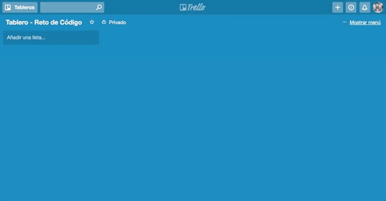

En este reto, vamos a replicar el tablero de Trello, para ello vamos a seguir un flujo de versiones que te guiarán en dónde enfocarte desde un inicio.

Al igual que en el reto anterior, puedes usar tu propio estilo o seguir la del sitio original. A continuación puedes ver como debe quedar:

